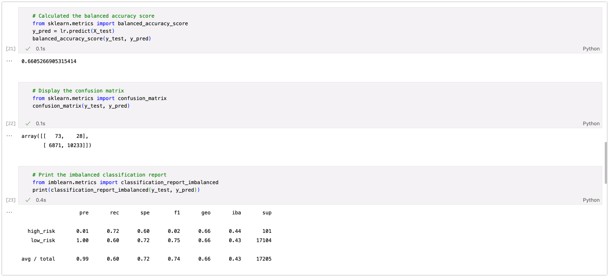
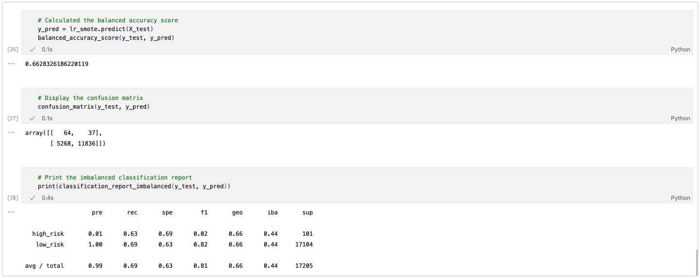
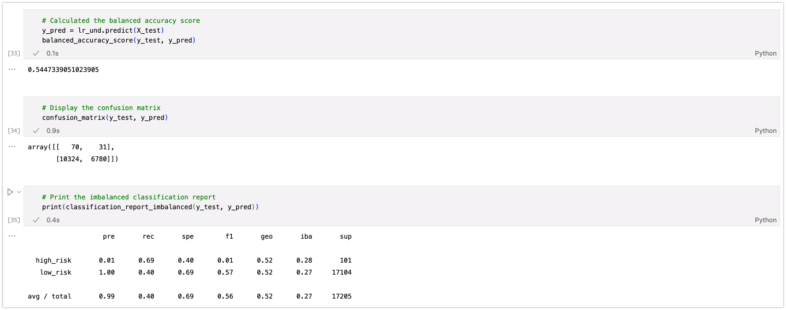
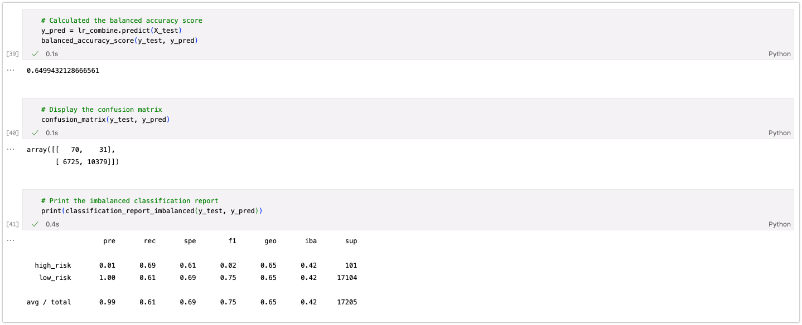
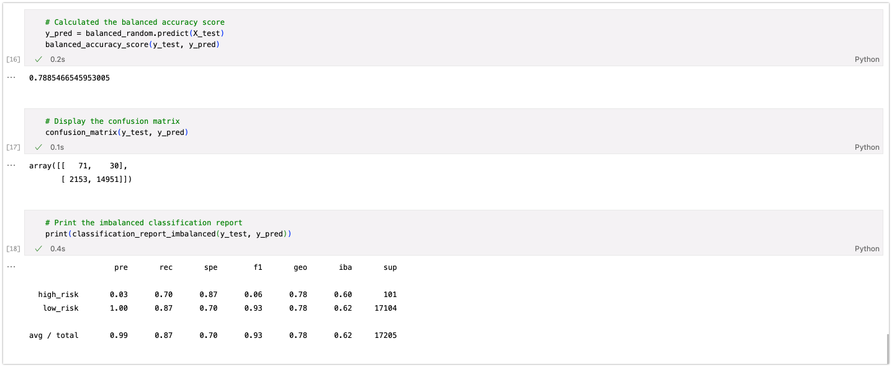

# Credit Risk Evaluation
## Background
Credit risk is an inherently unbalanced classification problem, as good loans easily outnumber risky loans. Therefore, we will need to employ different techniques to train and evaluate models with unbalanced classes. Using `imbalanced-learn` and `scikit-learn` libraries to build and evaluate models using resampling.

Using the credit card credit dataset from `LendingClub`, a peer-to-peer lending services company, we will oversample the data using the RandomOverSampler and SMOTE algorithms, and undersample the data using the ClusterCentroids algorithm. Then, we will use a combinatorial approach of over- and undersampling using the SMOTEENN algorithm. Next, we will compare two new machine learning models that reduce bias, BalancedRandomForestClassifier and EasyEnsembleClassifier, to predict credit risk. Once you’re done, we will evaluate the performance of these models and make a written recommendation on whether they should be used to predict credit risk.
## Results
### Six Machine Learning Models
- **Naive Random Oversampler**
- **SMOTE**
- **Cluster Centroid**
- **Smoteenn**
- **Balanced Random Forest**
- **Easy Ensemble Classifier**
--- 
### Native Random Oversampler

| **Balanced Accuracy Score** | **Precision** | **Recall** |
|:----------------------------:|:-------------:|:----------:|
|              66%             |       1%      |     72%    |

---
### SMOTE

| **Balanced Accuracy Score** | **Precision** | **Recall** |
|:----------------------------:|:-------------:|:----------:|
|              66%             |       1%      |     63%    |

---
### Cluster Centroid

| **Balanced Accuracy Score** | **Precision** | **Recall** |
|:----------------------------:|:-------------:|:----------:|
|              54%             |       1%      |     69%    |

---
---
### Smoteenn

| **Balanced Accuracy Score** | **Precision** | **Recall** |
|:----------------------------:|:-------------:|:----------:|
|              65%             |       1%      |     69%    |

---

### Balanced Random Forest

| **Balanced Accuracy Score** | **Precision** | **Recall** |
|:----------------------------:|:-------------:|:----------:|
|              78%             |       3%      |     70%    |

---
### Ada Boost

| **Balanced Accuracy Score** | **Precision** | **Recall** |
|:----------------------------:|:-------------:|:----------:|
|              93%             |       9%      |     92%    |

---

## Recommendation
Based on the above results, ` Easy Emsembler Ada Boost` algorithm performed better among all models. With high Accuracy and Recall it is better suited to identify high credit risks.

